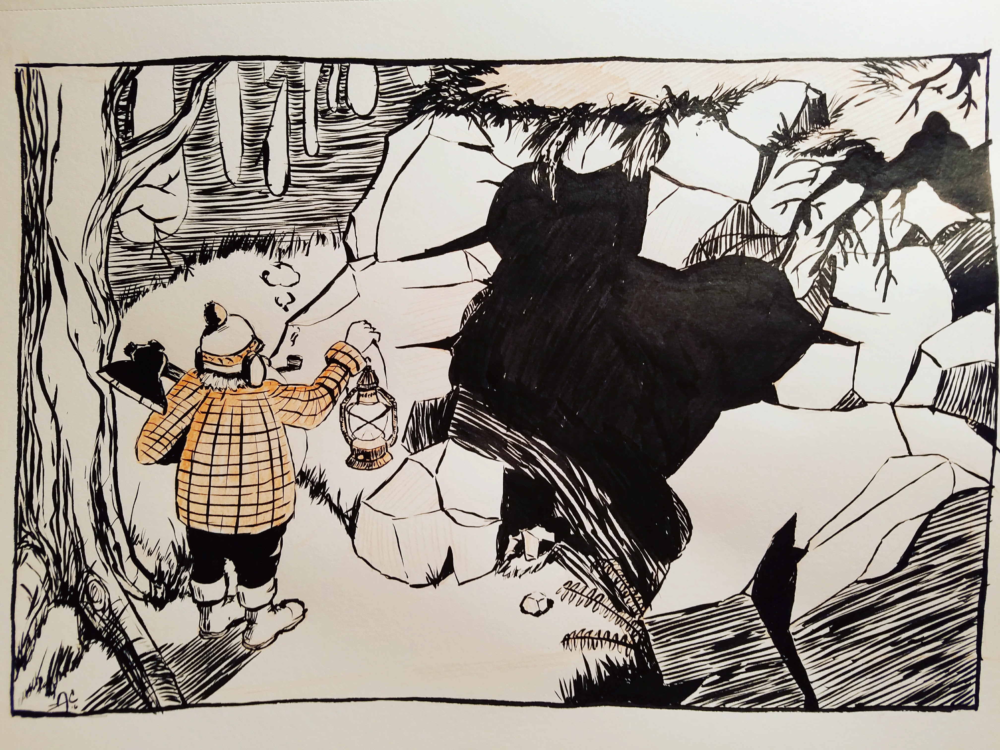

This is "Lonely" Lenny. He was always a bit of a solitary fellow, but he has a big heart, and never shy to help a stranger. After several seasons as a fire-watch, Lenny decided to stay in the wilds and try to carve out a life there. If you get a chance to stop by, he always has a warm fire going, and can entertain you with bizarre tales, true or otherwise.

Here we find Len out for a nice paddle and pipe, showcasing his Mark III handmade canoe. Early editions were prone to capsize unexpectedly, dousing many a well-packed pipe.

In time, Len became quite the craftsman, and he spent his time building canoes, furniture, and small carvings. He even had a custom chess set round the cabin and fancied an occasional game with folks passing through. Often, people would trade goods for his handiwork, but it never hurt to have a little gold saved away. Len had learned how to pan the streams from his pappy. Came in mighty handy.

Though Len had constructed himself a handsome cabin, many nights still found him cooking by a cheery fire, under the stars. Can you blame him? Everyone knows food cooked and eaten outside tastes better.

Shoot. Looks like Len just popped out to get some more firewood. No matter. You can see what I meant by, "handsome cabin." I can't reckon where Len picked up his decorative taste, but I think it's safe to say he wasn't lacking. His central fireplace idea was the envy of all his guests.

The nickname "Lonely Lenny" was tossed around by Len and his friends as a joke, however, I reckon that though he was always a jolly and warm soul -- truly...he was lonely.

I suppose an adventure might do old Len some good. There's no telling whom he might meet, or what wonders he may discover. His bag was packed, his axe sharpened, a prayer was whispered - ...and out the door he stepped...

Len is quite the resourceful chap when it comes to bushcraft, but only a blockhead strikes out on an adventure without essential gear.

It would be quite the mistake to take Len for a simpleton. Having plenty of time for reading (and one ought never underestimate the knowledge gained from books), Len always surprised folks with his insights on a range of topics.

Here we catch up with him at one of his first stops on his adventure: an ice fishing hut on Frosty Lake. I guess Len found peace in the muted calm of the snow all around.

Though Lenny may be regarded as one of the most interesting men in the world, I don't want anyone (nor would he) entertaining foolish ideas that he does not struggle with some of the same mundane activities we all face. For instance, a man can hardly be expected to wrestle mountains lions while parched... 

One particularly calm day, Len came across a cave while out gathering wood for his evening campfire. Len raised his trusty lantern and peered cautiously into the opening. 
A thing peered back...

It could be easy to misinterpret what you see here as "fleeing in terror," this is merely an old survival bush trick Len picked up along one of his many adventures. If there is one thing any good outdoorsman knows: better to fall back and assess the situation, when facing an "unknown." These encounters require strategy, after all. 

What can I say? I appears that the "avoid" strategy wasn't looking to pan out. The creature approached. Len made no sound as he tried to catch a glimpse of the beast's reflection with his knife...

Claws: check. 

Size: I'd venture large, to very large. 

Interested in cold beer and a friendly game of chess: doubtful.

Here's what old Len saw. There would be no talking his way out of this scrape. Hardly moving, Len peered around the stump for a better look. The bear crouched, staring back...waiting. Len's time as a fire-watch had well prepared him for waiting and staring. I wonder if lighting a pipe is against bear staring rules? 

In certain circumstances, you have no choice but to enjoy bad circumstances. Len reasoned there would be no out-running the bear, so might as well try and go out with a good pipe in hand. Perhaps the bear enjoyed tobacco smoke, or maybe Len's calm demeanor was just so inviting, but it proceeded to drop the axe, sit down, and stare at him, curiously.

At length Len slowly approached the bear and gently picked up his axe. I don't speak bear, but it certainly seemed to take a somewhat warm interest in Len. Len decided to make a gesture of thanks toward the bear for returning his axe, as well as...you know...not eating him. 

Despite running out of sausages, the bear continued to follow Len. Odd as it might seem, I believe both Len and the bear were grateful for each others company. You might even say they were becoming friends. It's hard not to be Len's friend.

Whether the bear was technically "helping" Len with Christmas decorations could be debated. They were clearly both having a wonderful time, regardless. Merry Christmas, All!

<h2 class="recent-header">Some Special Visits</h2>

In fact, Len did pay your fine cabin a visit, Jared. A very Merry Christmas to [@mountain_lines](https://www.instagram.com/mountain_lines/) and his family. (who deserves full creative genius credit for this drawing. I just recreated and modified it here. Seriously, go follow him) 
Thanks for inspiring me to draw stuff, brother!

[@dustybrockway](https://www.instagram.com/dustybrockway/) (who came up with the original this is a copy of) creates such magical realms, they became a natural destination for Len and the Bear, along their many adventures together. ... Michael has been a great encouragement to me since I started scrawling rubbish on instagram. His artwork is fantastic, and you should follow him for sure. Merry Christmas brother!

Len received a kindly gift from a like minded wilderness veteran up north [@augustillustrated](https://www.instagram.com/augustillustrated/). The pickup was definitely his style. Old Maple, he called 'er. But only when he found the bear snoozing in the bed, did he reckon they would make a proper trio. ... A much belated thanks and Merry Christmas to my friend [@augustillustrated](https://www.instagram.com/augustillustrated/). Thanks so much for the card and continued encouragement! 

<h2 class="recent-header">Additional Thoughts</h2>

Inktober was probably the most fun thing I have done creatively in recent memory. Every day I tried to challenge myself with something new. I feel so much more confident in my drawing and inking skill with each passing day. Not to mention, following along with the incredible community of talented folks on Instagram was a treat. I can hardly wait until next year!

Here's a little video I put together of Len, halfway through:

<blockquote class="instagram-media" data-instgrm-version="7" style=" background:#FFF; border:0; border-radius:3px; box-shadow:0 0 1px 0 rgba(0,0,0,0.5),0 1px 10px 0 rgba(0,0,0,0.15); margin: 1px; max-width:658px; padding:0; width:99.375%; width:-webkit-calc(100% - 2px); width:calc(100% - 2px);">
 
 

<a href="https://www.instagram.com/p/BLrMerPjW2q/" style=" color:#c9c8cd; font-family:Arial,sans-serif; font-size:14px; font-style:normal; font-weight:normal; line-height:17px; text-decoration:none;" target="_blank">A video posted by Andrew Colclough (@bullet_and_whiskey)</a> on <time style=" font-family:Arial,sans-serif; font-size:14px; line-height:17px;" datetime="2016-10-17T18:57:58+00:00">Oct 17, 2016 at 11:57am PDT</time>

</blockquote>

